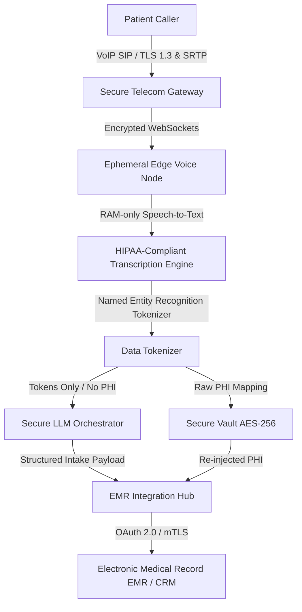

## HIPAA and AI Voice Agents: Separating Fact from Fear

The single most common hurdle behavioral health treatment centers encounter when considering artificial intelligence is compliance: *"Can an AI voice agent handle patient phone calls and still remain fully HIPAA compliant?"*

Many compliance officers and clinical directors operate under the assumption that automation and artificial intelligence are inherently incompatible with the strict mandates of the Health Insurance Portability and Accountability Act (HIPAA). This caution is understandable. The behavioral health sector handles some of the most sensitive Protected Health Information (PHI) in healthcare. The consequences of a data breach or non-compliant transmission are not only financial (with civil penalties ranging from thousands to millions of dollars) but also deeply personal, potentially damaging patient trust and recovery journeys.

However, the short answer is: **yes, AI voice agents can be fully HIPAA compliant — but only if the system is architected from the ground up specifically for healthcare environments.**

In fact, when configured correctly, a centralized AI voice agent can represent a significant security *upgrade* over legacy systems. Traditional answering services and third-party call centers rely on high-turnover human operators. These operators often type PHI on unprotected home computers, write details on physical note pads, or work in environments where unauthorized family members can overhear sensitive medical calls. A dedicated, deterministic AI agent removes human error, does not suffer from fatigue, and enforces encryption protocols uniformly across every single call.

---

## What HIPAA Actually Requires for Voice AI

HIPAA does not prohibit the use of AI or cloud-based platforms in patient interactions. Instead, it mandates that any system processing, transmitting, or storing Protected Health Information (PHI) implements a strict set of safeguards to protect the confidentiality, integrity, and availability of that data. 

For AI voice agents, compliance is structured across three core safeguard categories:

### 1. Administrative Safeguards
* **Business Associate Agreements (BAAs)**: A BAA is a legally binding contract that establishes a vendor's liability for protecting PHI. It must be signed by every entity in your data chain, from the AI application layer down to the underlying speech-to-text (STT), large language model (LLM), and text-to-speech (TTS) infrastructure.
* **Workforce Training & Operational Policy**: Standard operating procedures must clearly outline how employees interact with the AI portal, view call transcripts, and sync records to the Electronic Medical Record (EMR).
* **Incident Response & Risk Assessment**: Regular risk analyses must identify potential vulnerability points in database integrations or VoIP signaling, accompanied by an active plan to isolate and address any breach.

### 2. Technical Safeguards
* **Encryption in Transit**: Every audio packet and API call must be encrypted using current standards. For web-based VoIP and SIP signaling, this requires Secure Real-time Transport Protocol (SRTP) and TLS 1.2 or TLS 1.3.
* **Encryption at Rest**: Any call recording, transcription, or database record containing patient details must be encrypted using AES-256 or better.
* **Access Control & Identity Management**: Enforcing Role-Based Access Control (RBAC) ensures only authorized admissions personnel can view complete call details. This must be backed by multi-factor authentication (MFA) and automatic session logouts.
* **Audit Logging**: The system must log every instance where PHI is created, viewed, updated, or deleted, generating a tamper-proof audit trail.

### 3. Physical Safeguards
* **Secured Data Centers**: Hosting must reside within secure facilities (e.g., AWS, Google Cloud, or Microsoft Azure) certified with SOC 2 Type II and ISO 27001 credentials.
* **Geographic Data Residency**: All servers handling the voice streams, transcriptions, or metadata must reside physically within the United States to align with federal regulatory jurisdictions.

---

## Defining the Safe Scope: Pre-Screening vs. Clinical Assessment

To maintain compliance and protect clinical integrity, it is essential to establish a clear boundary between **administrative pre-screening** (which an AI agent is perfectly suited to handle) and **clinical assessment** (which must remain the exclusive domain of licensed human professionals).

An AI admissions agent should never diagnose a patient, recommend specific levels of care (e.g., advising a caller that they require inpatient residential rehab versus an outpatient IOP), or conduct clinical therapy. Its primary role is to serve as an empathetic, structured triage tool that gathers critical administrative and preliminary context so that the human admissions team can act instantly when they step in.

The following matrix defines the boundaries of safe data collection for an AI voice agent:

| Safe to Collect (Administrative Triage) | Defer to Human Clinician (Clinical Scope) |
|----------------------------------------|-------------------------------------------|
| **Caller Identity**: First and last name, callback number, relationship to the patient. | **Detailed Diagnosis**: In-depth psychiatric history or co-occurring disorder diagnoses. |
| **Insurance Information**: Payer name, policy ID, group number, and subscriber details. | **Prescription History**: Complete list of current medications, dosages, and compliance. |
| **General Substance/Reason**: Primary substance of concern (e.g., alcohol, opioids) or general symptom category. | **Detailed Medical History**: Complicated physical health histories, past surgeries, or active chronic diseases. |
| **Logistics & Timeline**: Preferred admission date, geographic preferences, and transportation needs. | **Specific Placement Decision**: Deciding if the patient meets ASAM criteria for a specific facility bed. |
| **Urgency Level**: General safety check (e.g., "Are you in a safe place right now?"). | **Crisis Counseling**: Providing de-escalation therapy during an active psychotic or self-harm episode. |

### Enforcing Clinical Safety Gates
If a caller indicates an active crisis—such as expressing suicidal ideation, experiencing severe physical withdrawal symptoms (like delirium tremens), or reporting a medical emergency—the AI agent must not continue a standard intake questionnaire. 

Instead, the system must immediately execute a clinical safety protocol:
1. **Verbal De-escalation**: Explain to the caller in a warm, calm tone that they need immediate care.
2. **Instant Hot Transfer**: Automatically route the call via SIP transfer to your on-call crisis clinician, a local emergency room, or the national 988 Lifeline.
3. **Emergency Alert**: Simultaneously send a high-priority SMS or phone notification to your lead admissions coordinator with the caller's location and phone number.

---

## The Encryption Architecture Blueprint

Deploying a secure AI voice agent requires a comprehensive technical stack that protects patient data at every step of the call flow. Below is the blueprint of how data is securely routed, processed, and synchronized from the moment the patient dials to the final sync with the EMR:

### 1. In-Transit Signaling and Audio Streams
The connection starts over the Public Switched Telephone Network (PSTN) or Voice over IP (VoIP). The session signaling is encrypted using SIP over TLS, and the actual media (the voice packets) is encrypted using Secure Real-time Transport Protocol (SRTP). This prevents any potential eavesdropping or "man-in-the-middle" attacks on the network layer.

### 2. Ephemeral Processing (RAM-Only Execution)
Once the audio stream reaches the AI edge node, the speech-to-text (STT) and conversational processing are executed in volatile memory (RAM). The audio chunks and raw transcriptions are processed ephemerally and are never written to physical disk storage on the edge servers. Once the call completes and the data is routed, the memory cache is immediately flushed.

### 3. Named Entity Recognition (NER) & Tokenization
Before transcripts are logged for administrative review, the system runs a Named Entity Recognition (NER) pipeline. The pipeline automatically scans the text for 18 specific HIPAA identifiers (names, dates, geographic data, phone numbers, email addresses, etc.). 

The system then tokenizes this data:
* **Text Logs**: The administrative log will display: `Caller [TOKEN_NAME_1] called requesting detox support. Callback number is [TOKEN_PHONE_1].`
* **Secure Vault**: The actual mapping of `[TOKEN_NAME_1] -> John Doe` is stored in a separate, isolated Database Vault encrypted at rest. This separation ensures that even if a system log is exposed, it contains zero identifiable health data.

### 4. Encryption at Rest (AES-256-GCM)
All persistent database storage, configuration files, and backup archives are encrypted using AES-256-GCM. Cryptographic keys are managed using a secure Key Management Service (KMS) with automated rotation cycles.

### 5. Secure EMR/CRM Webhook Delivery
When the intake is complete, the structured profile is pushed to your Electronic Medical Record (EMR) system (such as Kipu, Sunwave, or Salesforce Health Cloud). This transmission is secured using Mutual TLS (mTLS) or OAuth 2.0 client credentials, ensuring that only authenticated systems can receive the payload.

---

## Telephony Security Profile: Securing the SIP and SBC Layers

While much of the healthcare compliance discussion surrounds database encryption and LLM storage, the network transmission of voice data—known as the **telephony security profile**—is frequently overlooked. If the connection between the caller and the AI agent is not encrypted, the call is vulnerable to packet sniffing, interception, and spoofing on the public internet.

To establish a clinical-grade telephony profile, an AI voice system must implement strict security controls at the Session Initiation Protocol (SIP) and Session Border Controller (SBC) levels:

### 1. SIP Over TLS (Signaling Layer Encryption)
SIP is the protocol used to establish, modify, and terminate multimedia communication sessions (phone calls). By default, SIP transmits signaling details—such as caller IDs, phone numbers, routing information, and session metadata—in plain text. 
To secure this layer, facilities must require **SIP over TLS (Transport Layer Security)**. TLS encrypts the control channel, ensuring that all session setup negotiations, authentication handshakes, and routing commands are completely hidden from eavesdroppers.

### 2. SRTP (Media Plane Encryption)
The signaling layer setup is only half the battle; the actual audio data (the voice packets containing PHI) is transmitted over a separate channel called the media plane. In standard telephony, this uses the Real-time Transport Protocol (RTP) in plain text.
A compliant system must enforce **Secure Real-time Transport Protocol (SRTP)**. SRTP uses advanced cryptographic algorithms, typically **AES-128 or AES-256 in Counter Mode (AES-CTR)**, to encrypt the voice payloads. Without the proper decryption keys, any intercepted voice packets render as unintelligible white noise.

### 3. Session Border Controllers (SBCs) as Security Gateways
An SBC acts as a specialized firewall designed specifically for voice-over-IP (VoIP) traffic. Placed at the edge of the network, the SBC performs critical security tasks:
- **Topology Hiding**: Conceals the internal IP address schemes and architecture of the treatment facility's network, preventing malicious actors from mapping target nodes.
- **DDoS Mitigation**: Rates-limits call requests and filters out invalid SIP packets to protect the AI system from telephony denial-of-service (TDoS) attacks that aim to knock admissions lines offline.
- **Media Transcoding & Termination**: Terminates external TLS and SRTP tunnels, decrypts the media, and routes it over secure internal WebSockets to the ephemeral AI nodes, preventing any unencrypted exposure.

---

## Named Entity Recognition (NER) vs. Regex for De-identification

Once the voice data is transcribed, facilities must decide how to scrub Protected Health Information (PHI) to prevent it from leaking into administrative logs or training sets. This de-identification process generally relies on two primary technologies: Rules-Based Regular Expressions (Regex) and Machine Learning-based Named Entity Recognition (NER).

Evaluating the trade-offs between these two approaches is essential for security design:

### Rules-Based Regular Expressions (Regex)
Regex scans text for predefined structural patterns, such as sequences of numbers that match the format of a Social Security Number (###-##-####) or a phone number (###-###-####).
- **Advantages**: Incredibly fast processing latency (<5 milliseconds), low computational cost, and deterministic execution (if the pattern matches, it will always fire).
- **Disadvantages**: Highly brittle. Regex cannot detect unstructured entities like patient names, addresses, or clinical symptom descriptions. If a caller spells out their name or writes a date in an unusual format (e.g., "the third of November"), Regex will miss it, causing a critical compliance leak.

### Named Entity Recognition (NER)
NER utilizes machine learning models (such as clinical BERT or specialized transformer architectures) trained on millions of medical records. These models evaluate the semantic context of a sentence to identify names, locations, clinical terms, and dates.
- **Advantages**: Context-aware. NER understands that in the sentence "I met with Dr. Adams at the clinic in Portland," both "Adams" and "Portland" are PHI, even though they follow no fixed numerical pattern.
- **Disadvantages**: Higher processing latency (50–150 milliseconds), requiring GPU acceleration, and a non-deterministic margin of error (it may occasionally misclassify a non-sensitive word as PHI).

### The Comparative Breakdown

| Security & Performance Metric | Rules-Based Regex | Machine Learning NER | Hybrid Pipeline (Beacon Standard) |
|-------------------------------|-------------------|----------------------|-----------------------------------|
| **F1-Score (Accuracy)** | ~60% – 70% (Brittle) | ~94% – 98% (Contextual) | **>99.2% (Comprehensive)** |
| **Scrubbing Latency** | < 5 milliseconds | 50 – 150 milliseconds | **10 – 30 milliseconds (Optimized)** |
| **Unstructured Text Capture** | Extremely Low | High | **High** |
| **False Positive Rate** | Zero | Low-Moderate | **Controlled / Dynamic** |
| **System Overhead** | Negligible | Moderate-High (GPU needed)| **Managed / Scaled** |

### The Hybrid Solution
To achieve maximum compliance, modern voice platforms implement a **hybrid pipeline**. The system first runs a high-speed Regex layer to instantly scrub structured identifiers (such as Policy IDs and phone numbers). It then passes the remaining text through an optimized, clinical-grade NER model to redact names, relationships, and locations. This dual-stage pipeline ensures sub-50ms latency while keeping data leakage risks below 1%.

---

## Navigating Business Associate Agreement (BAA) Pitfalls

A Business Associate Agreement (BAA) is the legal cornerstone of HIPAA compliance. However, simply signing a BAA template is not enough. Many generic software vendors provide BAAs that contain clauses that leave treatment facilities exposed to massive legal and financial liabilities.

Compliance officers must carefully audit three critical BAA pitfalls:

### 1. Downstream Sub-contractor Flow-Downs
An AI system relies on multiple technology layers: telecom providers (to route the call), speech-to-text engines (to transcribe it), LLM APIs (to process it), and database servers (to store it). 
- **The Pitfall**: A vendor may sign a BAA with your facility, but use a transcription provider or LLM provider with whom they do *not* have a signed BAA. If a breach occurs on the downstream server, your BAA with the primary vendor may not protect you from regulatory fines.
- **The Requirement**: Ensure the BAA contains a strict **flow-down clause**, contractually binding all sub-contractors, subsidiaries, and third-party APIs to the exact same compliance standards.

### 2. Standard vs. Tightened Breach Notification Windows
Under HIPAA regulations, a business associate has up to **60 days** from the discovery of a security breach to notify the covered entity.
- **The Pitfall**: In the digital age, a 60-day delay in discovering that patient records or transcripts were leaked online is unacceptable. By the time you are notified, your facility's reputation is already destroyed.
- **The Requirement**: Negotiate a tightened breach notification window. The BAA should mandate notification within **24 to 48 hours** of any suspected or confirmed unauthorized access, allowing your IT team to coordinate immediate containment.

### 3. Data De-identification and Training Rights
Many mainstream AI and LLM developers incorporate user prompts and data inputs to train their future public models.
- **The Pitfall**: Some vendor BAAs include clauses allowing them to "de-identify" your patient logs and use that data for "internal product improvement" or "model training." However, de-identification is not foolproof. If a patient mentions a highly unique set of circumstances, they can be re-identified, resulting in a HIPAA violation.
- **The Requirement**: The BAA must explicitly forbid the vendor from using any data—even if de-identified—for AI training. The system must operate under a strict **Zero Data Retention (ZDR)** profile where data is processed ephemerally and deleted immediately upon task completion.

---

## The Compliance Officer's Audit Checklist

If you are a compliance officer or IT director auditing an AI vendor, use this 6-point checklist to evaluate their security posture before signing a Business Associate Agreement:

1. **Verify Downstream BAAs**: 
   Ensure the vendor has signed BAAs not just with you, but also with their downstream infrastructure partners (e.g., Twilio, OpenAI, Anthropic, or Deepgram). A BAA is only as strong as its weakest link.
2. **Confirm Zero-Data-Retention (ZDR) APIs**: 
   Verify that the vendor is using the "Zero Data Retention" tier of their LLM and transcription providers. This contractually guarantees that your patient conversations are not stored on external developer servers, and are never used to train future public AI models.
3. **Review the SOC 2 Type II Report**: 
   Ask for the vendor's most recent SOC 2 Type II audit report. Pay close attention to the "Trust Services Criteria" for Security, Confidentiality, and Privacy. Check for any noted exceptions or failures in their control environments.
4. **Inspect Access Control Configurations**: 
   Ensure the admin dashboard supports Single Sign-On (SSO), Multi-Factor Authentication (MFA), and enforces Granular Role-Based Access Control (e.g., allowing billing staff to see insurance details, but restricting access to clinical transcripts).
5. **Request Penetration Test Summaries**: 
   Ask for the executive summary of the vendor's latest third-party network and application penetration test. Verify that all high or critical vulnerabilities identified during the test were remediated within 30 days.
6. **Evaluate Disaster Recovery and Business Continuity**: 
   Review the vendor's uptime SLAs and backup strategies. A compliance failure can occur if your admissions line goes down during peak hours, leaving patients in crisis without a routing mechanism.

---

## Common Misconceptions About Voice AI in Healthcare

### Misconception 1: "Recording calls violates HIPAA automatically."
**Reality**: Recording calls is fully permissible under HIPAA, provided those recordings are encrypted, access-controlled, and stored within a secured database environment. However, you must also comply with state-level wiretapping and recording laws. In "two-party consent" states, you must include a brief disclosure at the start of the call (e.g., *"This call is recorded and assisted by AI to help secure your placement"*).

### Misconception 2: "AI voice agents cannot sign BAAs because they are software."
**Reality**: The AI software itself does not sign the BAA; the corporate entity representing the AI platform (such as Beacon Admit) signs the BAA as a Business Associate. They assume legal liability for safeguarding the transmission of PHI through their software pipeline.

### Misconception 3: "If the caller speaks Spanish, the compliance protections fail."
**Reality**: Modern multi-lingual AI engines process non-English languages using the same underlying secure pipelines. Translation, transcription, and entity extraction for languages like Spanish or French are subject to identical TLS 1.3, AES-256, and tokenization protocols.

---

## The Beacon Admit Approach

At Beacon Admit, compliance is not a feature we added after the fact—it is the foundation of our engineering architecture. We understand the unique pressures behavioral health facilities face, which is why we provide:

* **Comprehensive BAAs**: Signed immediately during onboarding, covering all downstream AI, telecom, and transcription systems.
* **Clinical Triage Limits**: Deterministic guardrails that instantly flag and route crisis calls to human personnel.
* **HL7 FHIR & Secure EMR Integrations**: Direct, encrypted sync to Kipu, Sunwave, and Salesforce Health Cloud.
* **Zero-Data-Retention Safeguards**: Guaranteeing your patient conversations are processed ephemerally and never stored by third-party LLM APIs.

By combining clinical empathy with enterprise-grade security, we ensure your admissions pipeline is always open, always responsive, and always protected.

---

*Do you need to review our full security architecture or obtain a copy of our standard Business Associate Agreement (BAA)? [Request a security packet from our compliance team](/#demo).*
